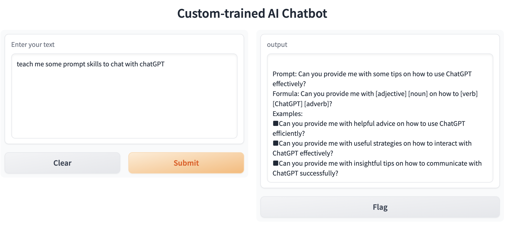

# TrainYourOwnChatGPT
Train your own chatGPT 

If you want to train your own model and build your own chatbot, please follow the steps.



1. Install python3 and pip

```
brew install python3
python3 -m pip install -U pip
```

2. Install openai as your LLM to train model

```
pip install openai
```

3. Install LlamaIndex to connect external GTP model as base

```
pip install llama-index
```

4. Install pdf parser

```
pip install PyPDF2
pip install PyCryptodome
```

5. Install gradio to interact as a chatBot

```
pip install gradio
```

6. [Apply](https://platform.openapi.com/account/api-keys) an OpenAPI key 

```
os.environ["OPENAI_API_KEY"] = '<your key>'
```

7. Put your pdfs in docs and start your bot
```
python3 app.py
```


Reference: [link](https://beebom.com/how-train-ai-chatbot-custom-knowledge-base-chatgpt-api/)
